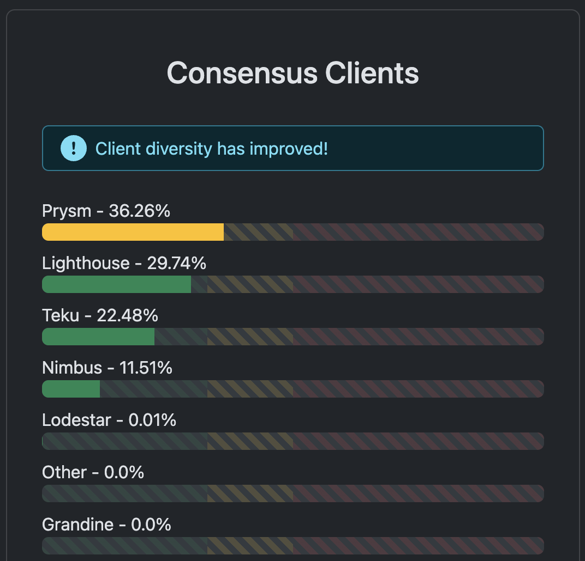
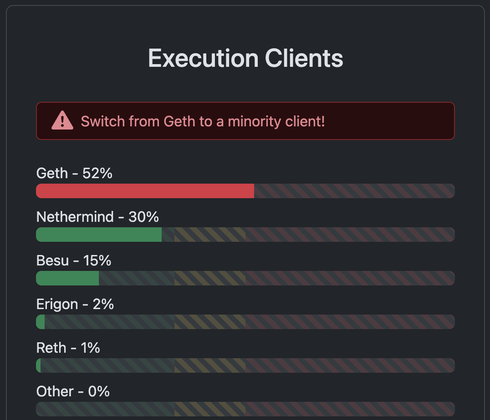

# 1. Why is client diversity important in Ethereum?

Client diversity is important for several reasons:

## 1. Bugs

A bug in an individual client is less of a risk to the network when representing a minority of Ethereum nodes. With a roughly even distribution of nodes across many clients, the likelihood of most clients suffering from a shared issue is small, and as a result, the network is more robust.

## 2. Security

Client diversity has already proven to be an important defense against malicious attacks on the network, for example the Shanghai denial-of-service attack in 2016 was possible because attackers were able to trick the dominant client (Geth) into executing a slow disk i/o operation tens of thousands of times per block. Because alternative clients were also online which did not share the vulnerability, Ethereum was able to resist the attack and continue to operate while the vulnerability in Geth was fixed.

## 3. Proof-of-stake finality

A bug in a consensus client with over 33% of the Ethereum nodes could prevent the consensus layer from finalizing, meaning users could not trust that transactions would not be reverted or changed at some point. This would be very problematic for many of the apps built on top of Ethereum, particularly DeFi.

A critical bug in a client with a two-thirds majority could cause the chain to incorrectly split and finalize(opens in a new tab), leading to a large set of validators getting stuck on an invalid chain. If they want to rejoin the correct chain, these validators face slashing or a slow and expensive voluntary withdrawal and reactivation. The magnitude of a slashing scales with the number of culpable nodes with a two-thirds majority slashed maximally (32 ETH).

## 4. Shared responsibility

There is also a human cost to having majority clients. It puts excess strain and responsibility on a small development team. The lesser the client diversity, the greater the burden of responsibility for the developers maintaining the majority client. Spreading this responsibility across multiple teams is good for both the health of Ethereum's network of nodes and its network of people.

Below are images of the client diversity in Ethereum consensus and execution clients (as of August 2024):

<div style="display: flex;">
       
    
</div>

The distribution in case of consensus clients is much more evened out than in case of execution clients. Geth, as the most popular execution client, has a share of more than 50%, which is a critical level. However, the situation is much better that two and a half years ago, when the distribution of consensus clients was much more uneven. 

# 2. Where is the full Ethereum state held?

The Ethereum state (world state) is a mapping between addresses (accounts) and account states. The full Ethereum state is held in a modified Merkle-Patricia trie, which is a separate database that is not stored on the blockchain.

The world state can be seen as the global state that is constantly updated by transaction executions.

All the information about Ethereum accounts lives in the world state and is stored in the world state trie. If you want to know the balance of an account, or the current state of a smart contract, you query the world state trie to retrieve the account state of that account.

# 3. What is a replay attack? Which two pieces of information can prevent it?

A replay attack is an attack in which a valid signed transactions on one chain is submitted on another blockchain for illicit intent. This type of attack occurs when blockchain clients (e.g., geth, nethermind) or smart contracts do not have proper security measures in place, which results in a valid transaction being used again for malicious purposes.

How does this happen? Transactions are composed of multiple fields, including receiver address, amount, gas price, nonce, chain ID, and a signature. With these fields, one could generate a valid transaction payload. However, if this signed transaction isn't properly secured (i.e., it doesn't use enough unique or random data) or the blockchain client accepting it doesn't verify that if it hasn't been used, the transaction could be accepted again, leading to potential unauthorized access to funds or data state manipulation.

In order to prevent a replay attack, two fields, nonce and chain ID, are added. Nonce prevents the replay attack on the same blockchain, whereas chain ID prevents the replay attack on a different blockchain.

# 4. In a contract, how do we know who called a view function?

```msg.sender``` is a globally available variable that provides information about the sender of the message, i.e. who called a view function.