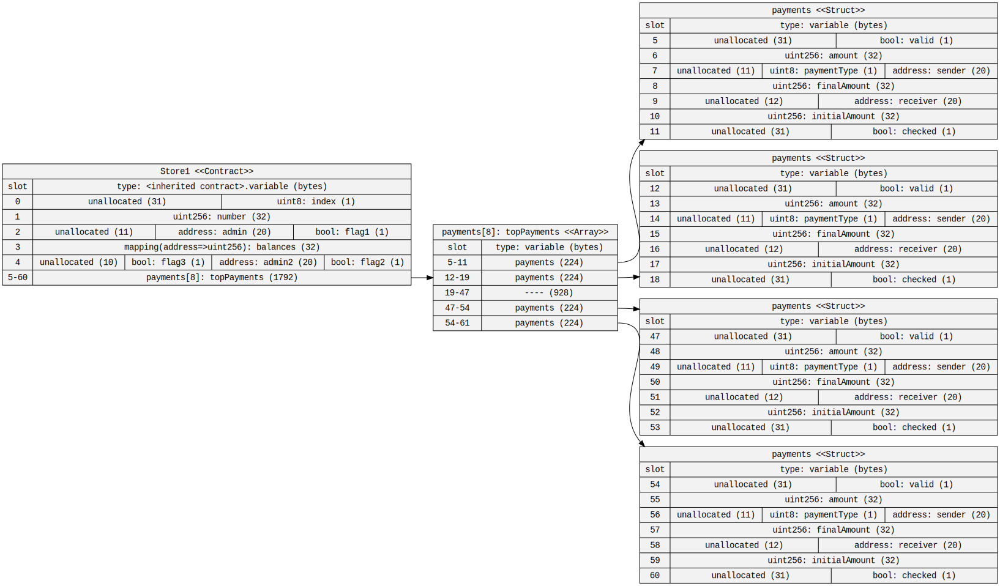
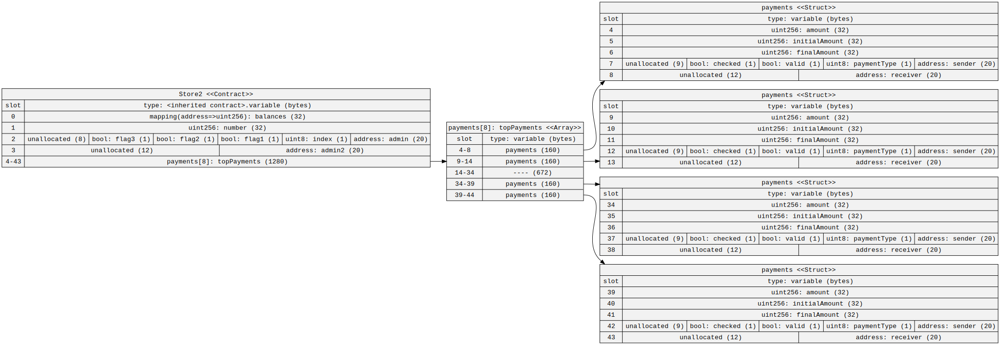

# Optimising Storage

Take [this](https://gist.github.com/extropyCoder/6e9b5d5497b8ead54590e72382cdca24) contract. Use the [sol2uml](https://github.com/naddison36/sol2uml) tool to find out how many storage slots it is using. By reordering the variables, can you reduce the number of storage slots needed?

<div style="display: flex;">
     
</div>

This is the original storage layout of the ```Store``` contract, generated by the ```sol2uml``` tool. The contract takes up 62 storage slots.

By reordering the variables and packing them together in the same slots, the number of storage slots is reduced from 62 to 45.

<div style="display: flex;">  
    
</div>

# Is this valid Solidity?

```
contract MyContract {
    uint256 public s_number;

    function myFunction(
        function(
            function(
                function(
                    function(
                        function(
                            function(
                                function (
                                    function(
                                        function() external pure 
                                    ) external pure 
                                ) external pure 
                            ) external pure 
                        ) external pure 
                    ) external pure 
                ) external pure 
            ) external pure 
        ) external pure 
    ) external pure {}
}
```

Yes, the contract and function you provided represent valid Solidity code. The function ```myFunction``` is an external, pure (read-only) function that takes a single argument of type ```function```. This argument is itself an external, pure function that takes a single argument of type ```function```, and so on. The code is deeply nested but technically valid in Solidity.

To simplify this concept, let's use a library in a more straightforward example.

```
library MyLibrary {
    function _myFunction(
        function() internal pure returns (uint256) _fun
    ) internal pure returns (uint256) {
        return _fun();
    }
}
```

In this example, the ```MyLibrary``` library defines an internal function ```_myFunction```, which takes a single parameter of type ```function```. This function must be internal and pure, returning a ```uint256```. The ```_myFunction``` function itself returns the ```uint256``` value produced by invoking the passed ```_fun``` function.

```
contract CallMyLibrary {
    // We're enhancing all the data types for simpler code
    using MyLibrary for *;

    function callMyFunction() external pure returns (uint256 firstNumber, uint256 secondNumber) {
        (firstNumber, secondNumber) = (_returnOne._myFunction(), _returnTwo._myFunction());
    }

    function _returnOne() internal pure returns (uint256) {
        return 1;
    }

    function _returnTwo() internal pure returns (uint256) {
        return 2;
    }
}
```

In the ```CallMyLibrary``` contract, we define two internal functions, ```_returnOne``` and ```_returnTwo```, which return ```uint256``` values of ```1``` and ```2```, respectively.

The external function ```callMyFunction``` calls the ```_myFunction``` function from the ```MyLibrary``` library twice, passing in the ```_returnOne``` and ```_returnTwo``` functions as arguments. The results from ```_myFunction``` are then assigned to the ```firstNumber``` and ```secondNumber``` variables, which are returned by the ```callMyFunction```.